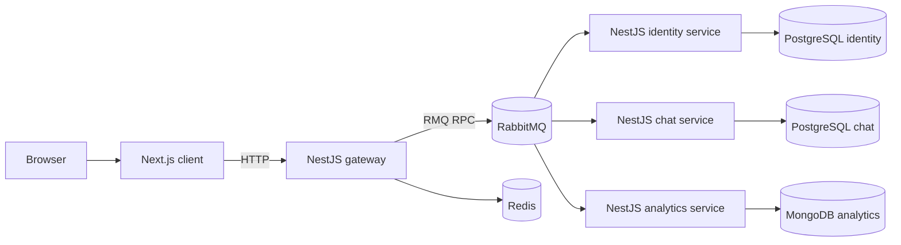
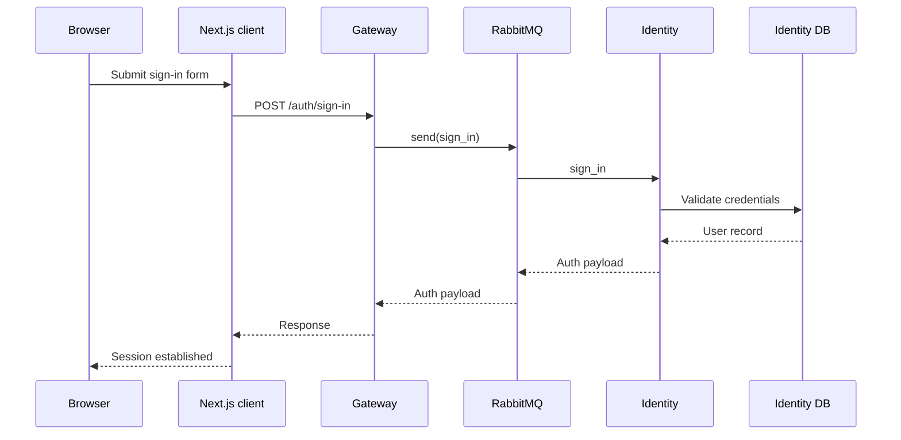
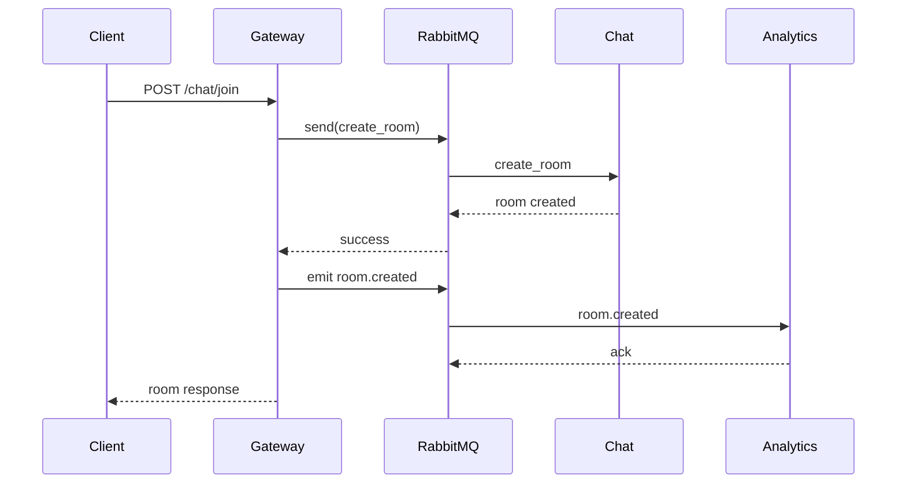
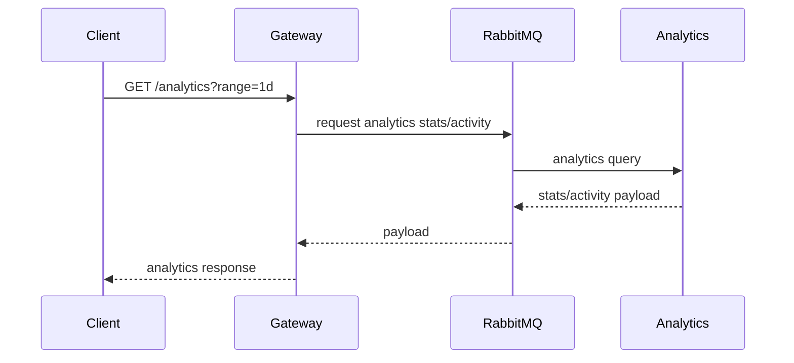

# DASI architecture

This document describes the current architecture implemented in this repository, including runtime boundaries, service responsibilities, communication patterns, and local/containerized deployment topologies.

## System context



## Service responsibilities

| Service | Responsibility | Main protocols | Persistence |
| --- | --- | --- | --- |
| `client` | Renders auth/chat/analytics UI, manages session cookies, calls gateway from route handlers/server helpers | HTTP | None |
| `gateway` | Public API entry point, JWT validation, request shaping, RMQ proxying, health reporting, realtime gateway | HTTP, RabbitMQ, WebSocket | Redis (realtime support) |
| `identity` | User registration, sign-in, refresh, token validation, user listing | HTTP, RabbitMQ | PostgreSQL |
| `chat` | Rooms, membership, message flows, chat event handling | HTTP, RabbitMQ | PostgreSQL |
| `analytics` | Aggregated platform stats and activity time buckets | HTTP, RabbitMQ | MongoDB |

## Repository topology

```text
services/
├── analytics/   # NestJS analytics service
├── chat/        # NestJS chat service
├── client/      # Next.js frontend
├── gateway/     # NestJS public API + realtime gateway
├── identity/    # NestJS auth/user service
├── docker-compose.dev.yaml
├── docker-compose.test.yaml
└── docker-compose.yaml
```

## Runtime architecture

### Client (`services/client`)

- Next.js 16 app using App Router.
- Public pages under `app/(public)`.
- Protected pages under `app/(protected)`.
- Route handlers under `app/api/*` call gateway endpoints.
- Browser clients are expected to call the gateway-backed APIs, not domain services directly.

### Gateway (`services/gateway`)

Gateway routes:

- Auth: `/auth/*`
- Chat: `/chat/*`
- Analytics: `/analytics/*`
- Health: `/health`
- Swagger: `/api`

Cross-cutting behavior:

- Applies global JWT guard (with explicit `@Public()` exceptions).
- Uses RabbitMQ clients for domain communication.
- Emits analytics events for selected chat actions.
- Hosts realtime gateway module (Socket.IO integration).

### Identity (`services/identity`)

Identity is responsible for:

- creating users
- authenticating users
- issuing/refreshing JWTs
- validating tokens
- listing users

Interfaces:

- Direct HTTP routes under `/user/*`
- RabbitMQ queue: `user`

### Chat (`services/chat`)

Chat is responsible for:

- room creation/join/leave flows
- room membership retrieval
- message persistence and retrieval

Interfaces:

- Direct HTTP routes and RMQ handlers
- RabbitMQ queue: `chat`

### Analytics (`services/analytics`)

Analytics is responsible for:

- platform-level counters (users/messages/chats)
- activity bucket snapshots by selectable range
- message-time based series support

Interfaces:

- HTTP routes (e.g., `/stats`, `/activity`, `/message-times`)
- RabbitMQ queue: `analytics`

## Request flows

### Sign-in flow



### Chat room creation + analytics event flow



### Analytics dashboard data flow



## HTTP API boundaries

### Public gateway routes

| Route | Purpose | Auth |
| --- | --- | --- |
| `POST /auth/sign-up` | Register user | Public |
| `POST /auth/sign-in` | Sign in | Public |
| `GET /auth/refresh` | Refresh access token | Bearer token |
| `GET /auth/users` | List users | Bearer token |
| `POST /chat/join` | Create/join chat room | Bearer token |
| `GET /chat/rooms` | List current user rooms | Bearer token |
| `POST /chat/members` | Get room members | Bearer token |
| `POST /chat/leave` | Leave room | Bearer token |
| `GET /analytics` | Overall platform totals | Bearer token |
| `GET /analytics/activity` | Aggregated activity buckets | Bearer token |
| `GET /analytics/message-times` | Message timestamps for range | Bearer token |
| `GET /analytics/activity/messages` | Message-based activity buckets | Bearer token |
| `GET /health` | API/infra health metadata | Public |

### Direct service routes

| Service | Route prefix | Notes |
| --- | --- | --- |
| Identity | `/user/*` | Internal/standalone identity API |
| Analytics | `/stats`, `/activity`, `/message-times` | Primarily consumed via gateway proxy in normal usage |

## Messaging architecture

RabbitMQ provides request/response and event delivery between gateway and domain services.

| Producer | Queue | Consumer | Patterns |
| --- | --- | --- | --- |
| Gateway | `user` | Identity | `sign_up`, `sign_in`, `refresh_token`, `list_users`, `validate_token`, `get_users_by_ids` |
| Gateway | `chat` | Chat | `get_chat`, `chat_event` |
| Gateway | `analytics` | Analytics | `analytics.stats`, `analytics.activity`, `analytics.message_times`, domain events |

## Data architecture

Each domain service owns its own storage:

| Database | Local port | Owner |
| --- | --- | --- |
| `identity` (PostgreSQL) | `5432` | Identity service |
| `chat` (PostgreSQL) | `5434` | Chat service |
| `analytics` (MongoDB) | `27017` | Analytics service |
| `redis` | `6379` | Gateway realtime/runtime support |

## Environments and deployment topology

### Local/manual development

Use `docker-compose.yaml` to boot infrastructure dependencies only:

```bash
cd services
docker compose -f docker-compose.yaml up -d postgres-identity postgres-chat mongo-analytics rabbitmq redis
```

Run app services from local source (`npm run start:dev` / `pnpm dev`).

### Full stack (local build)

`services/docker-compose.yaml` can also run all services with local builds:

```bash
cd services
docker compose up --build
```

### Full stack (prebuilt images)

`services/docker-compose.dev.yaml` runs a complete stack using published images.

### Test stack

`services/docker-compose.test.yaml` provisions isolated infra for backend e2e tests.

## Local development ports

| Component | Port |
| --- | --- |
| Gateway | `3000` |
| Identity | `3001` |
| Chat | `3003` |
| Analytics | `3004` |
| Client | `3100` recommended in dev |
| RabbitMQ | `5672` |
| RabbitMQ management | `15672` |
| Postgres identity | `5432` |
| Postgres chat | `5434` |
| Mongo analytics | `27017` |
| Redis | `6379` |

> Note: Next.js defaults to `3000`, which conflicts with gateway. Use `npx next dev --port 3100`.

## Operational notes

- Backend services load env vars from each service’s `env/.env.${NODE_ENV}` file.
- Swagger is exposed on `/api` in gateway/identity/chat services.
- Gateway health response includes realtime metadata.
- Redis is part of gateway runtime dependencies.

## Recommended integration path

1. Use the client app for user-facing UX.
2. Integrate external/backend consumers through gateway endpoints first.
3. Bypass gateway only when explicitly integrating service-level APIs.
4. Keep domain boundaries aligned with their owned databases and queues.
