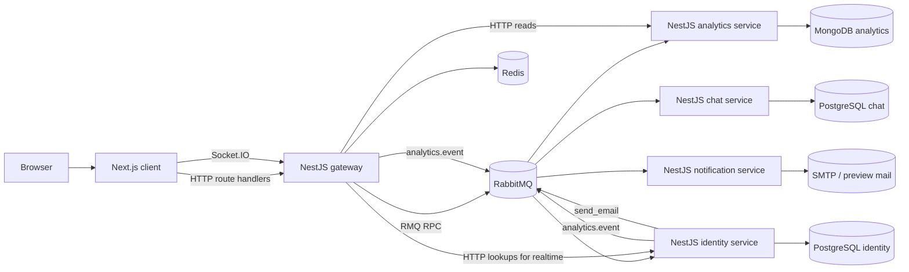
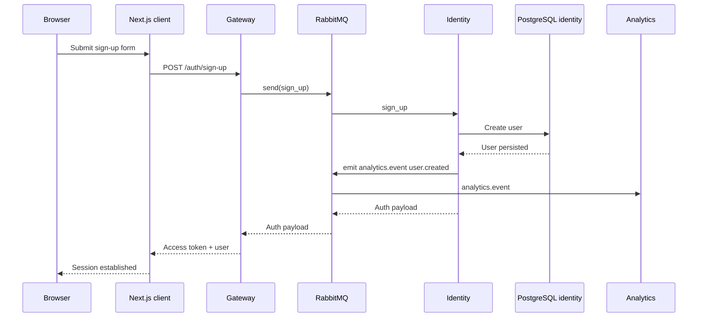
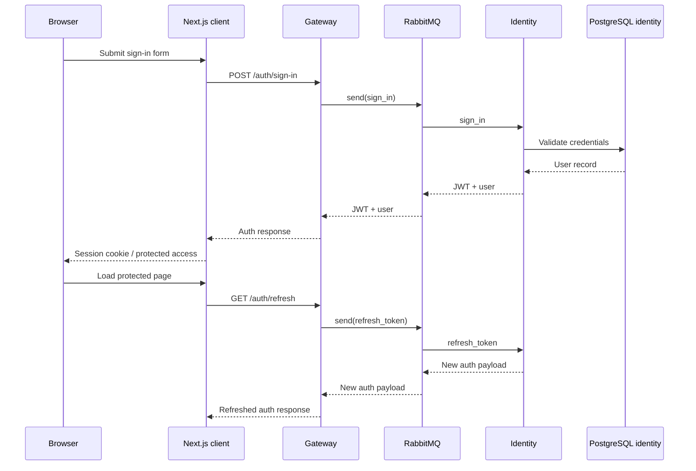
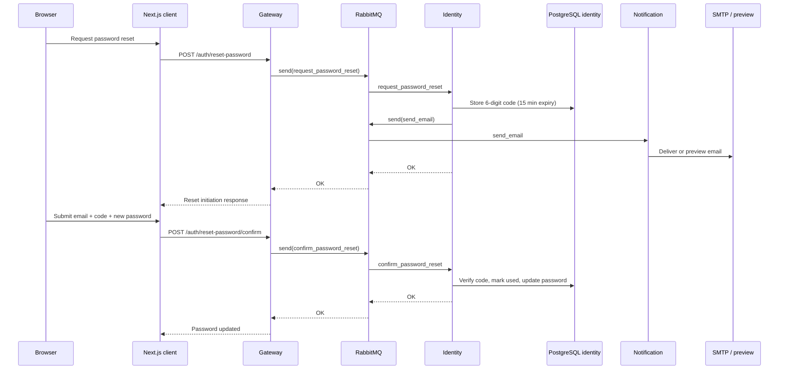
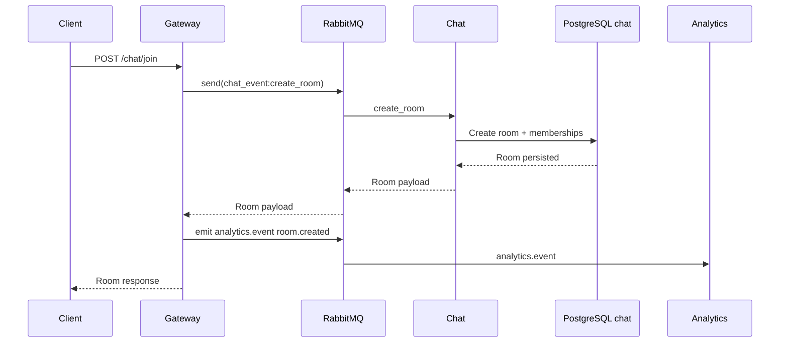
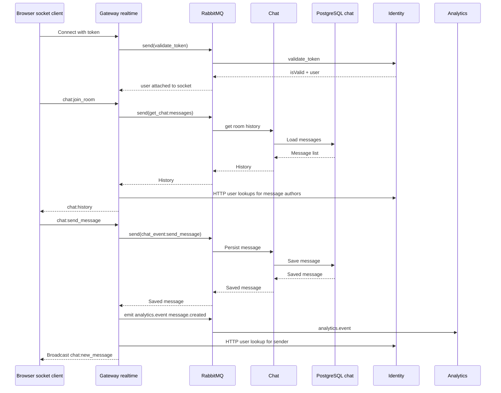
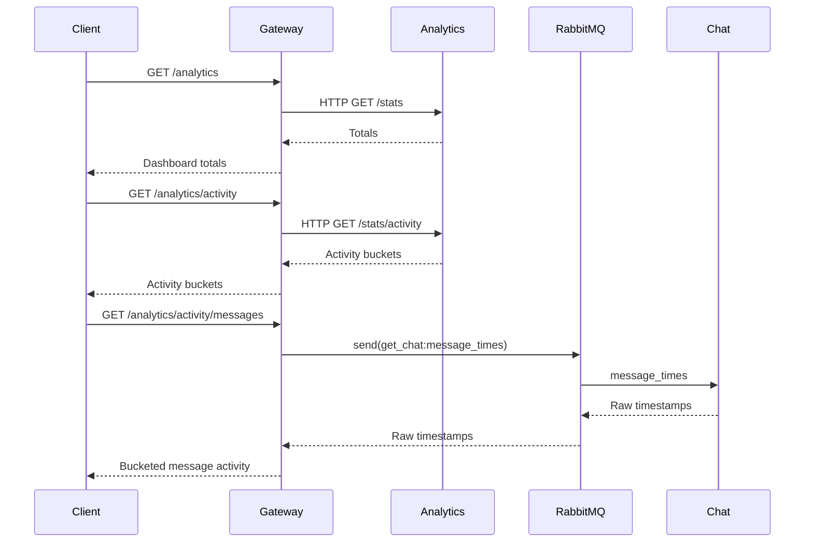

# DASI architecture

This document describes the architecture currently implemented in this repository. It covers the full system shape, the responsibilities of each service, the synchronous and asynchronous communication paths, the stored data, and the deployment options used for development and testing.

## System overview

DASI is a six-service platform:

- a Next.js client for the user-facing application
- a NestJS gateway that acts as the public HTTP and realtime entry point
- an identity service for authentication and user operations
- a chat service for rooms, members, and messages
- an analytics service for counters and activity timelines
- a notification service for email delivery

The system combines direct HTTP calls, Socket.IO realtime traffic, and RabbitMQ messaging. Each domain service owns its own data store, and cross-service workflows are coordinated by the gateway or by queue-based events.

## System context



## Architectural principles

1. The gateway is the public boundary for browser and external clients.
2. Each domain service owns its own persistence model and does not share a database with another domain.
3. RabbitMQ is used for commands and domain events between services.
4. Analytics uses a split model:
   - writes arrive as events through RabbitMQ
   - reads are served by direct HTTP calls to the analytics service
5. Email delivery is isolated behind the notification service so identity does not send SMTP traffic directly.
6. Realtime interactions terminate at the gateway even though the chat service also contains an internal websocket gateway.

## Service catalog

| Service | Main responsibility | Public-facing role | Main protocols | State owned |
| --- | --- | --- | --- | --- |
| `client` | Renders the application UI and forwards browser actions to the backend | User-facing web app | HTTP, Socket.IO | None |
| `gateway` | Public API, auth enforcement, RMQ orchestration, realtime gateway, health endpoint | Main external entry point | HTTP, Socket.IO, RabbitMQ | Redis-backed realtime/runtime state |
| `identity` | Sign-up, sign-in, token refresh, token validation, user lookup, password reset | Internal domain service with direct HTTP API | HTTP, RabbitMQ | PostgreSQL |
| `chat` | Room lifecycle, membership, message persistence, chat queries | Internal domain service | RabbitMQ, Socket.IO (internal) | PostgreSQL |
| `analytics` | Aggregated counters, activity buckets, event timeline queries | Internal read service | HTTP, RabbitMQ | MongoDB |
| `notification` | Email delivery for reset codes and future notifications | Internal worker service | RabbitMQ, SMTP | No domain database |

## Repository topology

```text
services/
├── analytics/         # NestJS analytics service
├── chat/              # NestJS chat service
├── client/            # Next.js frontend
├── gateway/           # NestJS public API + realtime gateway
├── identity/          # NestJS auth/user service
├── notification/      # NestJS email delivery worker
├── docker-compose.dev.yaml
├── docker-compose.test.yaml
└── docker-compose.yaml
```

## Runtime architecture by component

### Client (`services/client`)

The client is a Next.js 16 application using the App Router.

- Public screens live under `app/(public)`.
- Protected screens live under `app/(protected)`.
- Route handlers under `app/api/*` forward requests to the gateway instead of calling domain services directly.
- The client manages session state through server-side helpers and cookies.
- Browser-side realtime functionality connects to the gateway with Socket.IO.

The client is intentionally thin with regard to business rules. Domain decisions stay in backend services.

### Gateway (`services/gateway`)

The gateway is the central integration layer.

It exposes:

- `/auth/*`
- `/chat/*`
- `/analytics/*`
- `/health`
- `/api` for Swagger

It is responsible for:

- applying a global JWT guard, with explicit public exceptions
- proxying identity commands over RabbitMQ
- proxying chat commands over RabbitMQ
- reading analytics data over direct HTTP from the analytics service
- publishing analytics events such as `message.created` and `room.created`
- hosting the main Socket.IO gateway for chat and direct messaging
- performing identity lookups over direct HTTP during realtime flows
- exposing health information, including realtime status

This service is the place where synchronous browser traffic is translated into service-to-service communication.

### Identity (`services/identity`)

The identity service owns authentication and user management.

Main responsibilities:

- user registration
- sign-in
- JWT issuance
- JWT refresh
- token validation
- user listing
- user lookup by ID
- lookup of users by email
- creation and validation of password reset codes

Interfaces:

- direct HTTP routes under `/user/*`
- RabbitMQ queue `user`

The service stores both user records and password reset codes in PostgreSQL.

### Chat (`services/chat`)

The chat service owns the collaboration domain.

Main responsibilities:

- room creation
- room membership
- room membership retrieval
- message persistence
- room history retrieval
- message editing and deletion
- statistics and raw message timestamp queries

Interfaces:

- RabbitMQ queue `chat`
- an internal Socket.IO gateway used inside the chat service itself

The product-facing websocket boundary is still the gateway. The chat service websocket is best understood as an internal or alternate integration surface.

### Analytics (`services/analytics`)

The analytics service is event-driven on writes and query-driven on reads.

Main responsibilities:

- maintaining total users, total messages, and total chats
- storing append-only analytics events
- exposing bucketed activity views for selectable time ranges
- exposing message timestamp series used by analytics views

Interfaces:

- HTTP routes under `/stats*`
- RabbitMQ queue `analytics`

The service persists:

- a snapshot document for current totals
- event documents for timeline aggregation

### Notification (`services/notification`)

The notification service is an asynchronous worker.

Main responsibilities:

- consuming `send_email` messages from RabbitMQ
- delivering email through configured SMTP
- falling back to preview or log-style behavior in development scenarios

Interfaces:

- RabbitMQ queue `notification`

The notification service has no dedicated application database in this repository.

## Communication model

| Source | Destination | Protocol | Why it exists |
| --- | --- | --- | --- |
| Browser | Client | HTTP | Render pages and submit user actions |
| Client | Gateway | HTTP | Public API access through one entry point |
| Browser client | Gateway | Socket.IO | Realtime chat and direct message interactions |
| Gateway | Identity | RabbitMQ | Auth and user-related commands |
| Gateway | Chat | RabbitMQ | Chat queries and mutations |
| Gateway | Analytics | HTTP | Read analytics dashboards and time-series data |
| Gateway | Identity | HTTP | Resolve user info during realtime enrichment |
| Identity | Analytics | RabbitMQ event | Record `user.created` events |
| Gateway | Analytics | RabbitMQ event | Record `message.created` and `room.created` events |
| Identity | Notification | RabbitMQ command | Send password reset emails |

## Core request and event flows

### 1. Sign-up flow

This flow creates a new user, returns a token, and emits an analytics event.



Detailed notes:

- The gateway forwards the request to identity through the `user` queue.
- The identity service hashes the password before persisting the user.
- After successful sign-up, identity emits `analytics.event` with `user.created`.
- Analytics updates both its event log and its current snapshot.

### 2. Sign-in and refresh flow

Sign-in is synchronous from the client point of view, but it still uses RabbitMQ between gateway and identity.



Detailed notes:

- Token refresh is protected by the gateway JWT guard.
- The refreshed token is issued by identity, not by the gateway.
- The client uses this flow to restore authenticated state for protected pages.

### 3. Password reset flow

Password reset is implemented with a 6-digit code stored in the identity database and delivered asynchronously by the notification service.



Detailed notes:

- Reset codes are stored in PostgreSQL and are single-use.
- The code lifetime is 15 minutes.
- Email delivery is asynchronous and does not require identity to own SMTP configuration logic.
- The notification service can use a real SMTP provider, Ethereal preview, or log-only behavior when SMTP is missing.

### 4. HTTP room creation flow

The route name is `POST /chat/join`, but the current implementation creates a room and adds members.



Detailed notes:

- Chat owns room persistence.
- Gateway only coordinates the operation and emits analytics after success.
- This route is protected by JWT at the gateway.

### 5. Realtime chat message flow

Realtime chat is anchored in the gateway Socket.IO server.



Detailed notes:

- Socket authentication depends on identity token validation through RabbitMQ.
- The gateway keeps user-specific rooms such as `user:{id}` and chat rooms such as `room:{id}`.
- For chat history and broadcast payloads, the gateway enriches messages with identity data over HTTP.
- The gateway emits analytics events after successful message persistence.
- Additional websocket events include typing, room invitation, edit message, delete message, and leave room.

### 6. Analytics dashboard flow

Analytics reads are intentionally handled over HTTP instead of RabbitMQ.



Detailed notes:

- `/analytics` and `/analytics/activity` read directly from the analytics service.
- `/analytics/activity/messages` is special: it uses raw message timestamps from the chat service and buckets them in the gateway.
- This makes analytics both event-based and query-composed depending on the endpoint.

## Public API boundaries

### Gateway routes

| Route | Purpose | Auth |
| --- | --- | --- |
| `POST /auth/sign-up` | Register a new user | Public |
| `POST /auth/sign-in` | Sign in and get a token | Public |
| `GET /auth/refresh` | Refresh authenticated session | Bearer token |
| `POST /auth/reset-password` | Request a reset code by email | Public |
| `POST /auth/reset-password/confirm` | Confirm reset code and update password | Public |
| `GET /auth/users?page=&onPage=` | List users | Bearer token |
| `POST /chat/join` | Create a room and add members | Bearer token |
| `GET /chat/rooms` | Get current user rooms | Bearer token |
| `POST /chat/members` | Get room members with enriched user data | Bearer token |
| `POST /chat/leave` | Leave a room | Bearer token |
| `GET /analytics` | Read current totals | Bearer token |
| `GET /analytics/activity` | Read activity buckets | Bearer token |
| `GET /analytics/message-times` | Read raw analytics message timestamps | Bearer token |
| `GET /analytics/activity/messages` | Read message activity built from chat timestamps | Bearer token |
| `GET /health` | Health and realtime metadata | Public |

### Direct service APIs

| Service | Interface | Purpose |
| --- | --- | --- |
| Identity | `POST /user/sign-up` | Direct sign-up API |
| Identity | `POST /user/sign-in` | Direct sign-in API |
| Identity | `GET /user/refresh` | Direct refresh API |
| Identity | `GET /user/` | Direct user listing |
| Identity | `GET /user/:id` | Fetch a single user for enrichment |
| Identity | `POST /user/lookup-emails` | Convert invitee emails into user IDs |
| Analytics | `GET /stats` | Current totals |
| Analytics | `GET /stats/activity` | Activity buckets |
| Analytics | `GET /stats/message-times` | Message timestamp timeline |
| Chat | RabbitMQ + internal Socket.IO | Domain operations are not exposed as a stable REST API in the current implementation |

## Messaging architecture

RabbitMQ is used for both RPC-style commands and asynchronous domain events.

### Queues

| Queue | Main consumer | Purpose |
| --- | --- | --- |
| `user` | Identity | Auth and user-related commands |
| `chat` | Chat | Chat commands and chat queries |
| `analytics` | Analytics | Domain event ingestion |
| `notification` | Notification | Outbound email delivery |

### Message patterns

| Producer | Queue | Pattern | Meaning |
| --- | --- | --- | --- |
| Gateway | `user` | `sign_up` | Register user |
| Gateway | `user` | `sign_in` | Authenticate user |
| Gateway | `user` | `refresh_token` | Refresh JWT |
| Gateway | `user` | `list_users` | Fetch paginated users |
| Gateway | `user` | `get_users_by_ids` | Fetch specific users |
| Gateway | `user` | `validate_token` | Validate websocket or request token |
| Gateway | `user` | `request_password_reset` | Start password reset flow |
| Gateway | `user` | `confirm_password_reset` | Confirm reset code |
| Gateway | `chat` | `get_chat` | Read rooms, members, history, stats, message times |
| Gateway | `chat` | `chat_event` | Create room, send/edit/delete message, leave room |
| Identity | `analytics` | `analytics.event` | Emit `user.created` |
| Gateway | `analytics` | `analytics.event` | Emit `message.created`, `room.created` |
| Identity | `notification` | `send_email` | Send reset code email |

### Analytics event names

The analytics service currently handles these domain events:

- `user.created`
- `message.created`
- `room.created`

## Data architecture

Each service owns its own persistence model.

| Service | Storage | What is stored |
| --- | --- | --- |
| Identity | PostgreSQL | Users, password reset codes |
| Chat | PostgreSQL | Rooms, room members, messages |
| Analytics | MongoDB | Snapshot totals, append-only analytics events |
| Gateway | Redis | Realtime/runtime support metadata |
| Notification | No app database | Sends through SMTP or preview mode |

### Why this separation matters

- identity can evolve auth flows without coupling to chat persistence
- chat can optimize room and message models independently
- analytics can aggregate events without impacting transactional chat tables
- notification can scale independently from auth traffic

## Deployment and runtime topologies

### Local development with services from source

Use Docker only for infrastructure:

```bash
cd services
docker compose -f docker-compose.yaml up -d postgres-identity postgres-chat mongo-analytics rabbitmq redis
```

Then run the application services from source with `npm run start:dev` or `pnpm dev`.

### Full stack with local builds

To run the full platform through Docker using local service builds:

```bash
cd services
docker compose up --build
```

This stack includes:

- client
- gateway
- identity
- chat
- analytics
- notification
- PostgreSQL for identity
- PostgreSQL for chat
- MongoDB for analytics
- RabbitMQ
- Redis

### Full stack with prebuilt images

`services/docker-compose.dev.yaml` starts the complete stack from prebuilt images and environment files.

### Test stack

`services/docker-compose.test.yaml` provisions the isolated backend dependencies used by e2e tests. It currently focuses on:

- identity test PostgreSQL
- test RabbitMQ

## Local development ports

| Component | Port |
| --- | --- |
| Gateway | `3000` |
| Identity | `3001` |
| Chat | `3003` |
| Analytics | `3004` |
| Notification | `3005` |
| Client | `3100` recommended in development |
| RabbitMQ | `5672` |
| RabbitMQ management | `15672` |
| PostgreSQL identity | `5432` |
| PostgreSQL chat | `5434` |
| MongoDB analytics | `27017` |
| Redis | `6379` |

> Note: Next.js defaults to `3000`, which conflicts with gateway. Run the client on `3100` in development.

## Operational notes

- Backend services load env vars from `env/.env.${NODE_ENV}` or equivalent service-specific env files.
- The notification service also reads `env/.env.secrets` when present.
- Swagger is exposed on `/api` in gateway, identity, and chat services.
- Gateway health includes realtime metadata.
- Analytics writes are best-effort from the producer side so analytics failures do not block the main user path.
- The gateway is the recommended public realtime surface even though the chat service also contains its own Socket.IO gateway.

## Recommended integration path

1. Use the client for user-facing experiences.
2. Route external API consumers through the gateway first.
3. Treat direct service APIs as internal integration surfaces unless a use case explicitly requires them.
4. Keep domain ownership aligned with service-owned data stores and queues.
