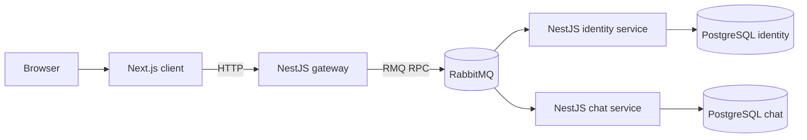
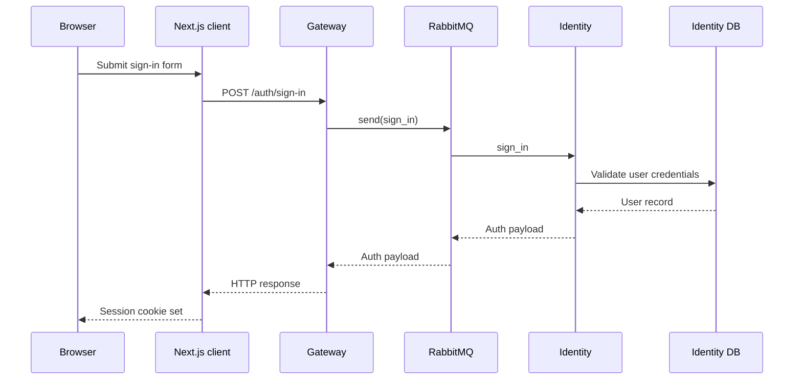
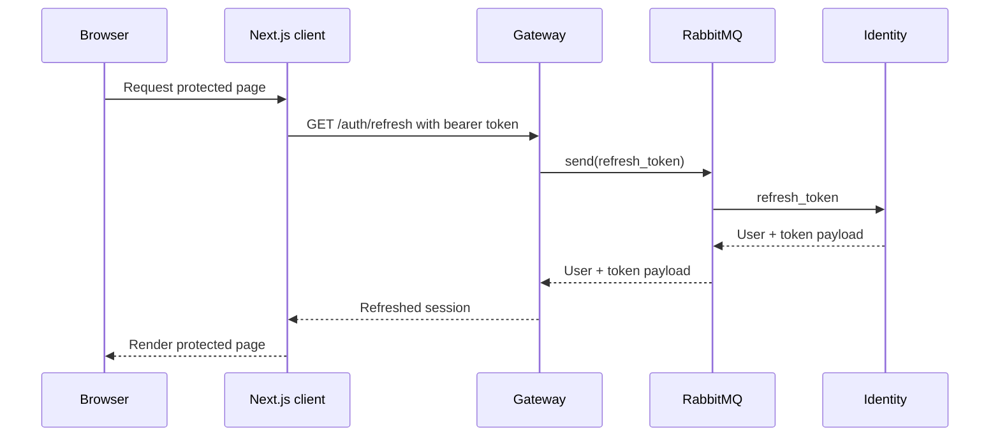

# DASI architecture

This document describes the current architecture implemented in the repository. It focuses on the actual runtime boundaries, communication patterns, local development topology, and the responsibilities of each service.

## System context



## Service responsibilities

| Service | Responsibility | Main protocols | Persistence |
| --- | --- | --- | --- |
| `client` | Renders UI, hosts auth forms, protects pages, manages session cookies, calls the gateway from server-side helpers and route handlers | HTTP | None |
| `gateway` | Public API entry point, JWT validation, request shaping, RabbitMQ proxying, health reporting, realtime/Socket.IO | HTTP, RabbitMQ | None |
| `identity` | User registration, sign-in, token refresh, token validation, user listing | HTTP, RabbitMQ | PostgreSQL |
| `chat` | Chat rooms, messages, room membership, RabbitMQ handlers | HTTP, RabbitMQ | PostgreSQL |

## Repository topology

```text
services/
├── client/      # Next.js frontend
├── gateway/     # NestJS gateway and public API
├── identity/    # NestJS auth and user service
├── chat/        # NestJS chat service
├── docker-compose.dev.yaml
├── docker-compose.test.yaml
└── docker-compose.yaml
```

## Runtime architecture

### Client

- The client is a Next.js 16 application.
- Public routes live under `app/(public)`.
- Protected routes live under `app/(protected)`.
- Auth route handlers under `app/api/auth/*` forward requests to the gateway.
- Session refresh is handled server-side through the gateway using the auth cookie.

Practical implication: browser code does not need to talk directly to identity or chat. The client talks to the gateway, and the gateway owns backend orchestration.

### Gateway

The gateway is the backend front door. It provides:

- `/auth/*` routes for sign-up, sign-in, refresh, and user listing
- `/health` for service health
- `/api` Swagger documentation
- Realtime/Socket.IO for chat

It also applies a global JWT guard and uses RabbitMQ clients to communicate with:

- the identity queue: `user`
- the chat queue: `chat`

### Identity

The identity service is responsible for:

- creating users
- authenticating users
- issuing and refreshing JWTs
- validating tokens for the gateway
- listing users

It exposes:

- direct HTTP routes under `/user/*`
- Swagger at `/api`
- a RabbitMQ microservice queue named `user`

Identity owns its own PostgreSQL database.

### Chat

The chat service is responsible for:

- chat rooms and messages
- room membership and invitations
- message history

It exposes:

- RabbitMQ microservice queue named `chat` (e.g. `get_chat`, `chat_event`)

Chat owns its own PostgreSQL database.

## Request flows

### Sign-in flow



### Authenticated page load



## HTTP API boundaries

### Public gateway routes

| Route | Purpose | Auth |
| --- | --- | --- |
| `POST /auth/sign-up` | Register a user | Public |
| `POST /auth/sign-in` | Sign in a user | Public |
| `GET /auth/refresh` | Refresh the session token | Bearer token |
| `GET /auth/users` | List users | Bearer token |
| `GET /health` | Gateway health and realtime status | Public |

### Direct service routes

| Service | Route prefix | Notes |
| --- | --- | --- |
| Identity | `/user/*` | Internal or standalone use; not the same public shape as the gateway |

Important distinction: the client and other consumers should use the gateway's `/auth/*` routes rather than the identity service's `/user/*` routes unless they are intentionally bypassing the gateway.

## Messaging architecture

RabbitMQ is used for request-response communication between the gateway and domain services.

| Producer | Queue | Consumer | Patterns |
| --- | --- | --- | --- |
| Gateway | `user` | Identity | `sign_up`, `sign_in`, `refresh_token`, `list_users`, `validate_token` |
| Gateway | `chat` | Chat | `get_chat`, `chat_event` |

This means the gateway is not calling identity or chat over HTTP for its primary runtime path.

## Data architecture

Each domain service owns its own PostgreSQL database:

| Database | Local port | Owner |
| --- | --- | --- |
| `identity` | `5432` | Identity service |
| `chat` | `5434` | Chat service |

This separation keeps service data boundaries explicit and matches the development and production compose files.

## Environments and deployment topology

### Development infrastructure

`services/docker-compose.dev.yaml` starts only the shared infrastructure:

- `postgres-identity`
- `rabbitmq`

Application services are started manually from their own directories in development.

### Containerized stack

`services/docker-compose.yaml` starts:

- `client`
- `gateway`
- `identity`
- `chat`
- `postgres-identity`
- `postgres-chat`
- `rabbitmq`
- `redis`

### Test stack

`services/docker-compose.test.yaml` provisions isolated infrastructure for backend e2e tests.

## Local development ports

| Component | Port |
| --- | --- |
| Gateway | `3000` |
| Identity | `3001` |
| Chat | `3003` |
| Client | `3100` recommended in dev |
| RabbitMQ | `5672` |
| Postgres identity | `5432` |
| Postgres chat | `5434` |

The client defaults to port `3000`, which conflicts with the gateway. For local development, run the client with `npx next dev --port 3100`.

## Operational notes

- All backend services load environment variables from `env/.env.${NODE_ENV}`.
- Swagger is available on `/api` for the gateway and identity services.
- The gateway health response includes realtime metadata.
- Redis configuration exists in the gateway, but realtime currently reports `enabled: false`.

## Recommended integration path

When building on top of DASI:

1. Use the Next.js client for browser-facing UX.
2. Integrate backend consumers through the gateway first.
3. Treat identity direct HTTP APIs as internal or service-level interfaces.
4. Use the service-specific READMEs for domain-level details.
